# 🧠 Prueba Técnica: Asistente de recordatorios de postura corporal con notificaciones push

**Conecta Mayor UC - Rodrigo Pavez**

---

## 🎯 Objetivo de la prueba

Desarrollar una aplicación en **Flutter** que permita a los usuarios configurar **recordatorios de postura corporal** y recibir **notificaciones push** en su dispositivo.

La app debe almacenar los recordatorios en una **base de datos local** y sincronizarlos con **Firebase Firestore**, para garantizar persistencia en la nube.

Esta aplicación está pensada para ser utilizada por **personas mayores**, con una interfaz clara, accesible y simple de usar.

---

## 🚀 Ejecución del proyecto

1. Clonar el repositorio

        https://github.com/Ronstein/reminders_app

   ```bash
   git clone https://github.com/Ronstein/reminders_app.git
   cd reminders_app
   ```
2. Instalar dependencias

   ```bash
   flutter pub get
   ```
3. Configurar Firebase (opcional si se utiliza una cuenta de firebase de terceros, ya que se ha dejado acceso al proyecto personal)

   * Agregar tu archivo `google-services.json` (Android)
   * Agregar `GoogleService-Info.plist` (iOS)
4. Ejecutar la app

   ```bash
   flutter run
   ```

---


## 📱 Características principales

### 1. Login de Usuario con Firebase Auth

El usuario puede iniciar sesión usando Firebase Auth. Para esta prueba, se creó un usuario de ejemplo:  

- **Email:** test1@gmail.com  
- **Contraseña:** 123456 

📸 *Captura de pantalla - Usuario creado en Firebase Auth:*

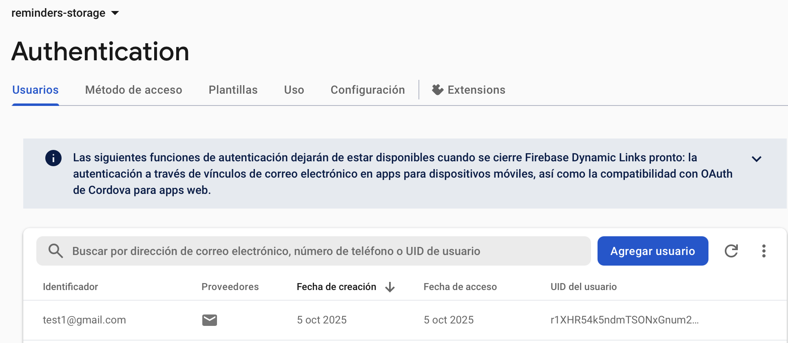

📸 *Capturas de pantalla - Login:*

| 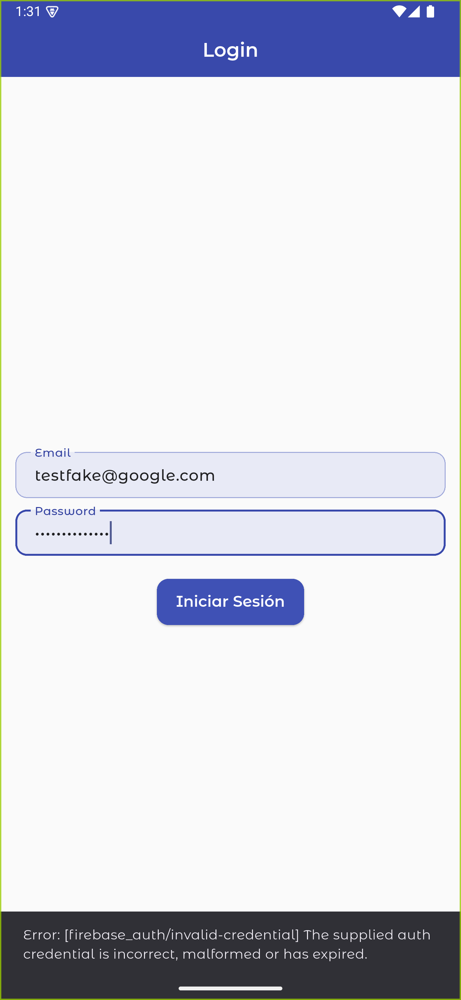 | 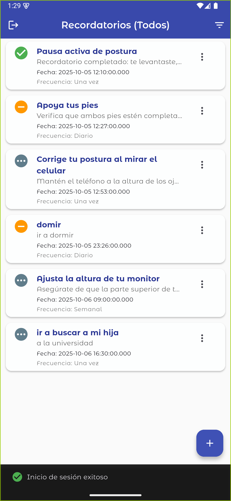 |
|---|---|

---

### 2. 🧾 Pantalla principal

* Muestra una **lista de recordatorios**, ordenados por fecha y estado.
* Permite **filtrar** por:

  * Pendientes
  * Completados
  * Omitidos
* La interfaz fue diseñada con **claridad y simplicidad**, pensada en adultos mayores.

📸 *Captura de pantalla - Lista principal de recordatorios:*
| 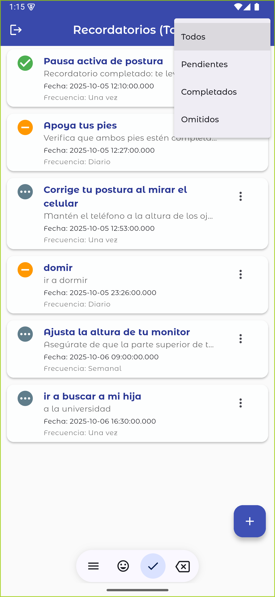 | 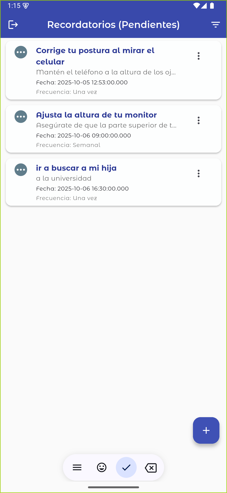 | 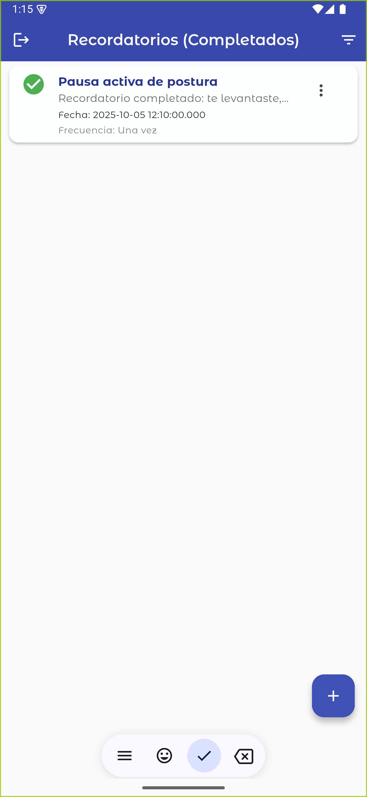 | 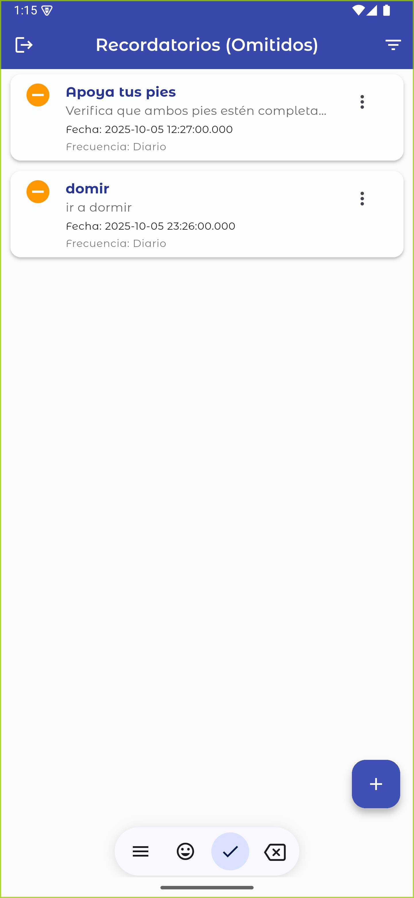 |
|---|---|---|---|

---

### 3. Creación y gestión de recordatorios

* El usuario puede **crear, editar y eliminar recordatorios** fácilmente.
* Cada recordatorio contiene los siguientes campos:

  * 🏷️ **Título:** Ejemplo: “Endereza tu espalda”
  * 📝 **Descripción:** Ejemplo: “Recuerda estar sentado con la espalda recta y los pies apoyados en el suelo.”
  * ⏰ **Fecha y hora:** Momento específico del recordatorio.
  * 🔁 **Frecuencia:** Único, Diario, Semanal o Personalizado.
  * 📌 **Estado:** Pendiente, Completado, Omitido.

* En el **listado de recordatorios**, el usuario puede:
  * Editar un recordatorio
  * Eliminar un recordatorio
  * Marcar un recordatorio como **Completado** directamente.
  * **Aplazar** un recordatorio 2 minutos para que la notificación vuelva a aparecer.

* Los recordatorios se guardan en **SharedPreferences** y se **sincronizan con Firebase Firestore**.

📸 *Captura de pantalla - Creación de recordatorio:*
| 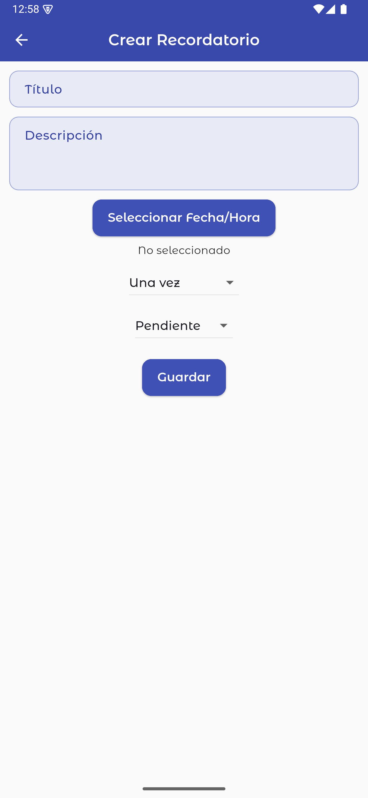 | 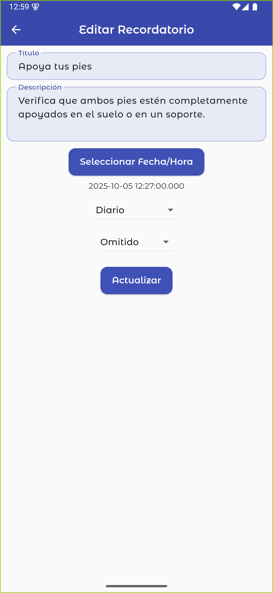 | 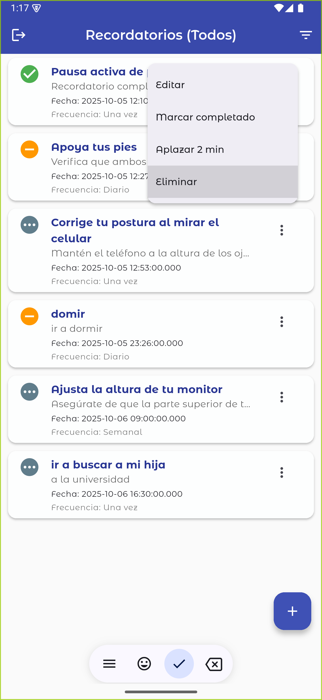 |
|---|---|---|

📸 *Captura de pantalla - Listado Recordatorios en Firestore:*

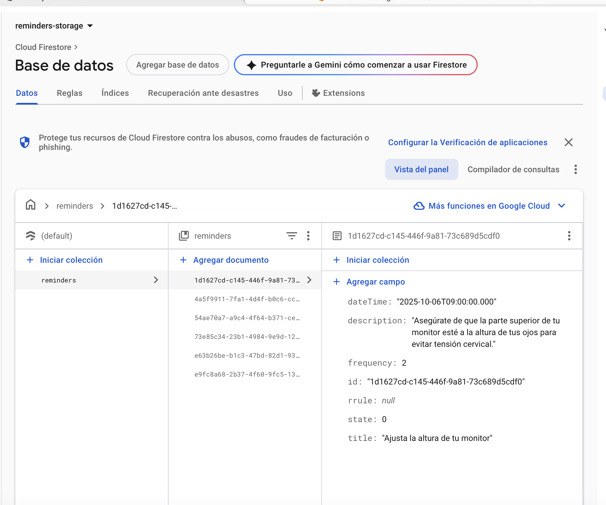

---

### 4. 🔔 Notificaciones Push

* Implementadas con **`flutter_local_notifications`**.
* La app envía notificaciones locales al llegar la hora del recordatorio.
* Cada notificación muestra:

  * El **título**
  * La **descripción**
* Desde la **notificación**, el usuario puede marcar el recordatorio como **"Completado"**.

📸 *Captura de pantalla - Notificación activa:*
| 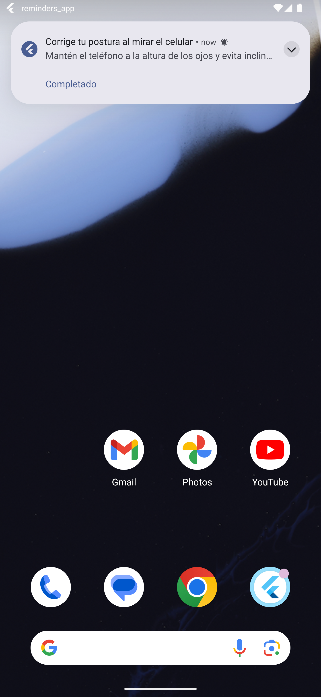 | 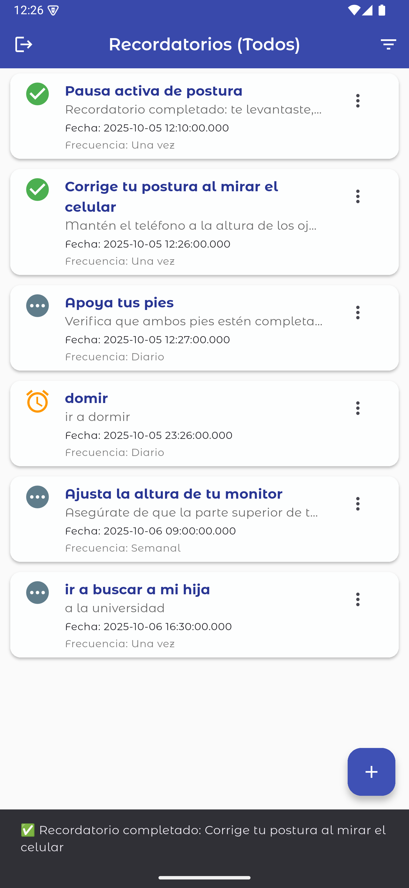 |
|---|---|


---

## 🧩 Tecnologías utilizadas

* **Flutter 3** (SDK estable)
* **Dart**
* **Firebase Auth**
* **Firebase Firestore**
* **SharedPreferences**
* **flutter_local_notifications**
* **Riverpod** para la gestión del estado
* **GoRouter** para la navegación
* **Material Design 3**


---


## 🙌 Autor

**Rodrigo Pavez**
Desarrollador Frontend & Mobile
Flutter | Swift | Android | React | Node.js
📧 [ron.pavezb@gmail.com](mailto:ron.pavezb@gmail.com)

---